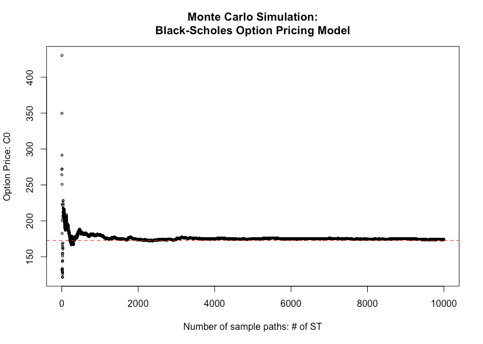
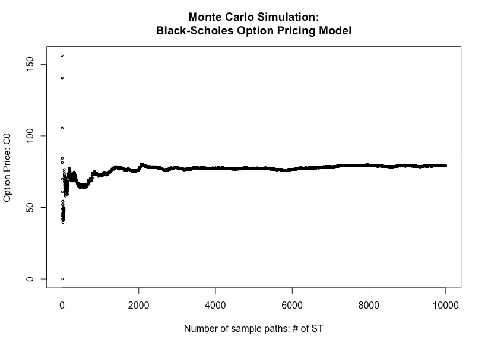

幾何ブラウン運動のサンプルパスを生成することにより，株価が幾何ブラウン運動にしたがう場合のコールオプション価格をモンテカルロシミュレーションにより導出し，サンプルパスの生成回数を増やすことで理論値に収束することをプロットにより確認する．

<br>

## 1. コールオプションの価格理論

#### ブラックショールズ式によるオプション価格の導出

満期$T$で原資産価格(株式価格)が連続時間確率過程$S = {(S_t)}_{t \in [0,T]}$に従うオプションの時刻$t \in [0, T]$における価格$C(t, S_t)$について考える．$S$が確率微分方程式:

$$
\begin{align}
    d S_t = \sigma S_t dt + \mu S_t d W_t
\end{align}
$$

の解で与えられているとする($S$は幾何ブラウン運動に従う)．時刻$t \in [0, T]$において，オプションの原資産価格$S_t$とオプションの行使価格$K$が与えられたとき，ブラック・ショールズ式によってオプションの理論価格$C(t, S_t)$は

$$
\begin{align}
    C(t, S_t) &= S_t \Phi(d_1) - K e^{-r(T-t)} \Phi(d_2) \\\\
    where ~~ 
    d_1 &= \frac{\log \left( \frac{S_t}{K} \right) + \left( r + \frac{\sigma^2}{2}  \right) T}{\sigma \sqrt{T}} \\\\
    d_2 &= \frac{\log \left( \frac{S_t}{K} \right) + \left( r - \frac{\sigma^2}{2}  \right) T}{\sigma \sqrt{T}} 
\end{align}
$$

となる．ただし，$r$は無リスク資産の利率，$\Phi$は標準正規分布$\mathcal{N}(0,1)の累積分布関数とする．ここで，簡単のために満期$T$を$1$とすると，現在($t=0$)のオプション価格の理論値は，

$$
\begin{align}
    C(0, S_0) &= S_0 \Phi(d_1) - K e^{-r} \Phi(d_2) \\\\
    where ~~ 
    d_1 &= \frac{\log \left( \frac{S_0}{K} \right) + \left( r + \frac{\sigma^2}{2}  \right)}{\sigma } \\\\
    d_2 &= \frac{\log \left( \frac{S_0}{K} \right) + \left( r - \frac{\sigma^2}{2}  \right)}{\sigma} 
\end{align}
$$

となる．

#### モンテカルロ法によるオプション価格の導出

ブラックショールズ式に含まれる$S_T$の期待値計算をモンテカルロ法によって近似することを考える．すなわち，幾何ブラウン運動に従うサンプルパス$S = {(S_t)}_{t \in [0,T]}$を大量に生成することで，$S_T$の期待値を求める．

モンテカルロシミュレーションによって生成された，満期$T$における原資産価格$S_T$の$n$個のサンプルを$(s^{(1)}_{T}, \cdots, s^{(n)}_{T})$とすると，時刻$t \in [0, T]$におけるオプションの価格の推定値$\hat{C}(t, S_t)$は

$$
\begin{align}
    \hat{C}(t, S_t) &= \frac{1}{n} \sum_{i=1}^{n} e^{-r(T-t)} \cdot max(s^{(i)}_{T} - K, 0)
\end{align}
$$

と求められる．ここで，簡単のために満期$T$を$1$とすると，現在($t=0$)のオプション価格の推定値は，

$$
\begin{align}
    \hat{C}(0, S_0) &= \frac{1}{n} \sum_{i=1}^{n} e^{-r} \cdot max(s^{(i)}_{1} - K, 0)
\end{align}
$$

となる．

<br>

## 2. Rでモンテカルロシミュレーション

[YUIMA](https://yuimaproject.com/)ライブラリをインストール（or 読み込み）する．

```r
install.packages("yuima") # インストール (初回のみ)
library(yuima) # ライブラリの読み込み
```

モンテカルロシミュレーションを実行するコード．

```r
# Calculation of call-option prices by Black-Sholes eq.
BlackScholesCallPrice = function(S, K, r, sigma, T=1)
{
    d1 <- ( log(S/K) + (r + sigma^2/2) * T)/( sigma * sqrt(T))
    d2 <- ( log(S/K) + (r - sigma^2/2) * T)/( sigma * sqrt(T))
    C0 <- S * pnorm(d1) - K * exp(-r * T) * pnorm(d2)
    return(C0)
}

# Calculation of call-option prices by Monte Carlo method
MonteCarloCallPrice = function(S, K, r, sigma, n, T=1)
{
    n_sample <- 1000
    c0_list <- list()
    c0 <- 0
    for (i in 1:n) {
        resultGBM <- GBM_sample(S, r, sigma, n_sample)
        sT <- resultGBM@data@original.data[n_sample]
        c0 <- (1/i) * exp(-1*r*T) * max(sT - K, 0) + ((i-1)/i) * c0
        c0_list <- append(c0_list, list(c0))
    }
    return(c0_list)
}

# A function which generates sample paths that follows a Geometric Brownian motion
GBM_sample = function(x0, alpha, beta, n_sample, T=1)
{
    # Step1: Define SDE
    # dS_t = alpha * S_t * dt + beta * S_t * dW_t
    mod <-setModel(drift="alpha*x", diffusion="beta*x")
    
    # Step2: Define samples
    samp <-setSampling(Initial=0, Terminal=T, n=n_sample)
    
    # Step3: define the statistical model
    smod <-setYuima(model=mod, sampling=samp)
    
    # Step4: Generate sample paths
    xinit <- x0
    param <- list(alpha=alpha, beta=beta)
    resultGBM <- simulate(smod, xinit=xinit, true.parameter=param)
    return(resultGBM)
}

# Params for call-option pricing
n <- 10000 # Num. of MonteCalro simulation
K <- 900 # Option exercise price (at t=T)
S <- 1000 # Curent asset price (at t=0)
r <- 0.005 # Drift for Geometric Brownian motion
sigma <- 0.3 # Diffusion for Geometric Brownian motion
T <- 1 # Optional term

# Main procedure: Run simulation
bs_price <- BlackScholesCallPrice(S, K, r, sigma, T=1)
mc_price <- MonteCarloCallPrice(S, K, r, sigma, n, T=1)
print(bs_price)
plot(1:n, mc_price, main="Monte Carlo Simulation:\nBlack-Scholes Option Pricing Model", xlab="Number of sample paths: # of ST", ylab="Option Price: C0", cex=0.5)
abline(h=bs_price, col='red', lwd=1, lty=2)
```

**Case 1.**



モンテカルロ法によるコールオプションの推定価格が，
BS式による理論価格172.7457に漸近している．

- パラメータ設定
  - n: 10000 # モンテカルロシミュレーションの回数
  - K: 900 # コールオプションの権利行使価格 (t=T)
  - S: 1000 # 株式の現在価格 (t=0)
  - r: 0.005 # 幾何ブラウン運動のdrift
  - sigma: 0.3 # 幾何ブラウン運動のdiffusion
  - T: 1 # オプションの満期

**Case 2.**



モンテカルロ法によるコールオプションの推定価格が，
BS式による理論価格83.1821に漸近している．

- パラメータ設定
  - n: 10000 # モンテカルロシミュレーションの回数
  - K: 1100 # コールオプションの権利行使価格 (t=T)
  - S: 1000 # 株式の現在価格 (t=0)
  - r: 0.005 # 幾何ブラウン運動のdrift
  - sigma: 0.3 # 幾何ブラウン運動のdiffusion
  - T: 1 # オプションの満期
