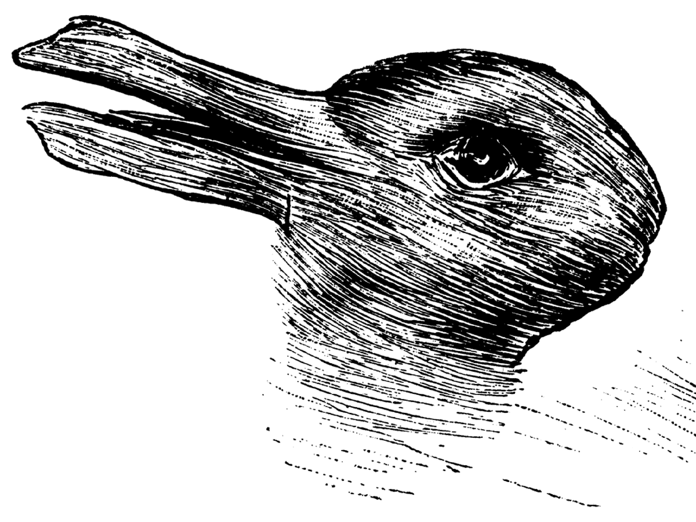
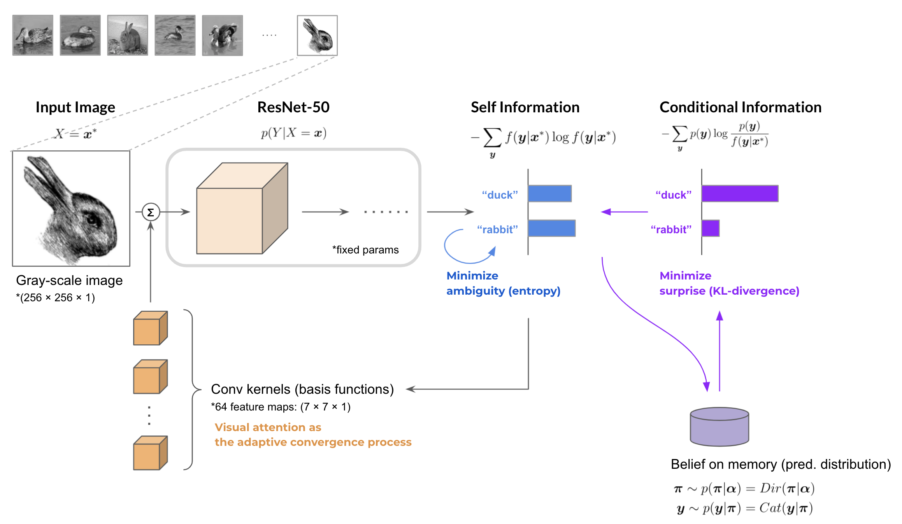
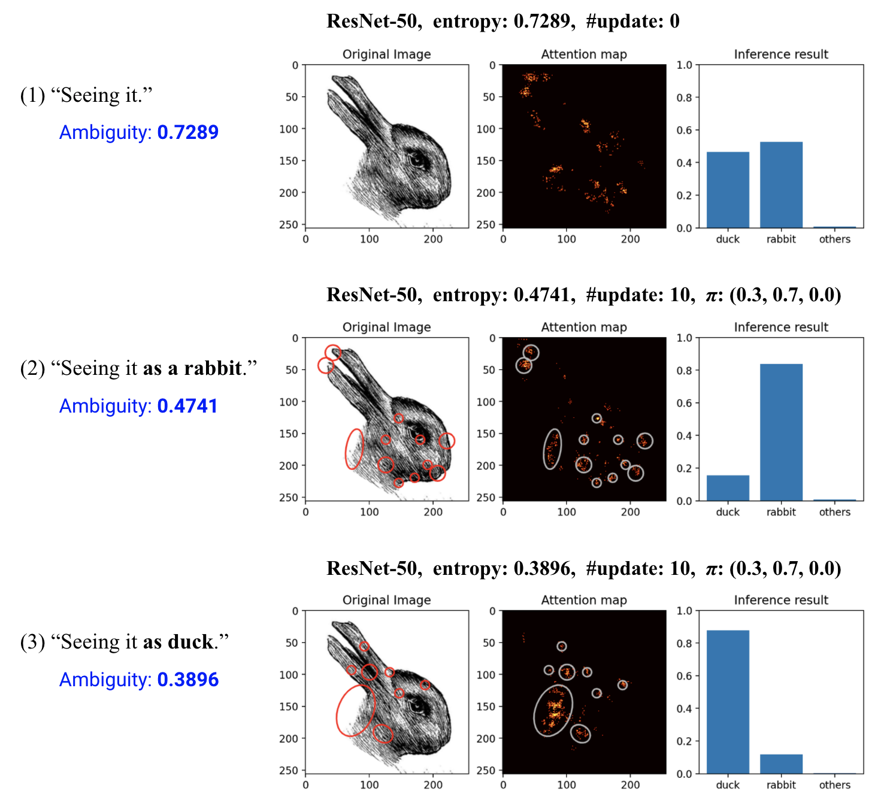

<div style="text-align: center;">
<i>Which does this look like a duck or a rabbit?</i>
</div>


##### Overview

In order to elucidate human perceptual functions, it is necessary to consider both bottom-up information processing, in which stimulus information received from the sensory organs is encoded into symbolic information, and top-down information processing, which is objective-oriented and based on memory, beliefs, and context. In this paper, we take the ResNet50 image classification problem as an example task, and conduct a basic study on the information processing when humans make judgments about visual information with ambiguities, and discuss the computation by which working memory during task execution penetrates the discrimination results of the model in a top-down manner.

```vim
Yuma Uchiumi, Yosuke Fukuchi, Mitsuhiko Kimoto, Michita Imai, 
“A Top-down Penetration to the Visual Attention via Elimination of the Ambiguity”, 
The 35th Annual Conference of the Japanese Society for Artificial Intelligence (JSAI 2021), 
Jun. 8-11, 2021, Virtual Conference.
```

<br>

### Measurement of the Ambiguity

When a single stochastic model $f:X \to Y$ get a data sample $\boldsymbol{x}^{\*}$ of the input random variable $X$, 
the ambiguity of the model's inference result can be defined as the conditional entropy of the output random variable $Y$.

$$
\begin{align}
A(Y; f, \boldsymbol{x}^{\*})
:= H^{(f)}(Y | X=\boldsymbol{x}^{\*} )
= -\sum_{\boldsymbol{y}} f(\boldsymbol{y} | \boldsymbol{x}^{*}) \log f(\boldsymbol{y} | \boldsymbol{x}^{\*})
\end{align}
$$

Next, if the model has the prior belief for the output variable $Y$,
the surprise of the model's inference result can be defined as the Kullback–Leibler divergence between 
the prior distribution $p(\boldsymbol{y})$ and the predicted distribution $f(\boldsymbol{y} | \boldsymbol{x}^{\*})$.

$$
\begin{align}
S(Y; f, \boldsymbol{x}^{\*}, p)
:= D_{KL}( p || f )
= -\sum_{\boldsymbol{y}} p(\boldsymbol{y}) \log \frac{ p(\boldsymbol{y}) }{ f(\boldsymbol{y} | \boldsymbol{x}^{\*}) }
\end{align}
$$

So that, the optimization process of $f$ is obtained as

$$
\underset{f}{\rm minimize} ~~
A(Y; f, \boldsymbol{x}^{\*}) + \beta \cdot S(Y; f, \boldsymbol{x}^{\*}, p)
$$

where $\beta$ is a weighting factor in $[0,1]$. The overall computation is shown below.

<br>

### Training the Model & Deriving the Ambiguity

First of all, we trained the ResNet-50 as the image classification model $f:$ 

$$
X \in \mathbb{R}^{H \times W \times C} \to Y \in \\{\text{duck}, \text{rabbit}, \text{others}\\}
$$

on the Google Open Image Dataset. 
Then, 
when the model makes inferences sequentially for a given image
the ambiguity and the surprise in the model is calculated.
The overall computation is shown below.



In the experiment, initially 30 images were sampled from the prior categorical distribution of the class label $Y$ and then its posterior distribution $p(y)$ (belief) was formed. Afterwards, the model made inferences for the Duck-Rabbit illusion image $\boldsymbol{x}^{\*}$.

<br>

### Plasticity of the Visual Attention

Futhermore, we applied the elimination process of the ambiguity to the model.
Target parameters of the convolutional kernels `conv1` in ResNet-50 was updated according to the defined metrics of the ambiguity and surprise.

The attention maps that the model had for the input image during inference are shown as the following figures. As the belief distribution makes a difference between them, 
the features that strongly affect the inference result are different 
in the duck-rabbit illusion image.



As the result, the proposed computation explains the phenomenon in which the inference process of the model itself is penetrated by higher cognitive elements such as the belief in a top-down manner.
